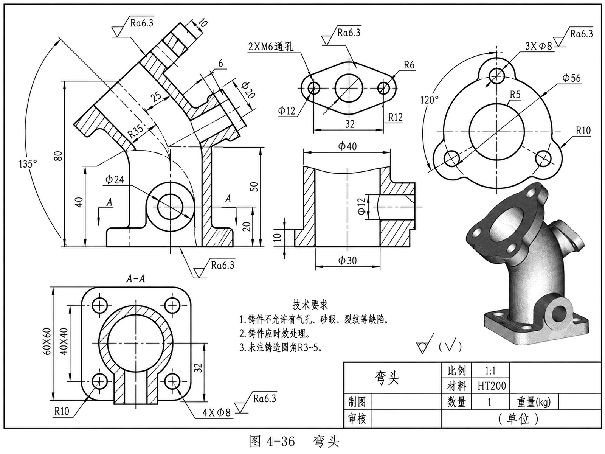

# SolidWorks Parametric CAD

面向工程图的 SolidWorks 自动建模实验项目：包括 agent skill、读图与位置关系规则，以及一个可运行的弯头案例。

这是公开发布的实验版。已记录弯头案例两次从空白零件到保存的完整执行，基础检查通过；不宣称任意工程图自动转换，也不宣称完整图纸自动验收通过。

## 作者与贡献

发起与维护：[panp20469-png](https://github.com/panp20469-png)。本项目由维护者提出读图、位置关系、局部修改与剖面对照要求，结合 AI 辅助整理 skill 和实现、调试自动化脚本。第三方 COM 客户端有单独来源与许可证，不属于维护者独立原创的底层实现。公开提交用于记录后续版本演进，不冒充全部早期开发历史。

## 案例展示

### 输入二维图纸



### 建模过程与结果

- [观看或下载建模演示视频](docs/demo/elbow-demo.mp4)：记录一次案例运行及模型展示；如果 GitHub 页面不能播放，可下载 MP4 查看。
- [下载原生 SolidWorks 模型](docs/demo/elbow.SLDPRT)：在 SolidWorks 中查看特征树、尺寸和剖面，与上图对照。
- [基础验证记录](docs/validation.md)：完整图纸验收仍待人工确认，不能把视频当作剖面一致性的证明。

输入图为维护者提供的“图 4-36 弯头”学习案例，教材名称、作者及公开再分发授权尚未核实，不主张该工程图为本项目原创，也不将其纳入 MIT 授权。这里展示的是固定案例的输入、执行过程与输出，不是任意图纸自动转换或完整剖面验收通过的证明。没有补画或伪造验收图片。

## 内容

- `solidworks-parametric-cad/`：skill 主文件、读图规则、几何转换说明及历史 VBS 工具。
- `examples/elbow/elbow_clean_rebuild/run_elbow.py`：弯头案例唯一推荐入口。
- `examples/elbow/external_sources/Solidworks-MCP-Server/sw_client.py`：基于第三方项目修改的 COM 客户端，保留上游许可证。
- `docs/validation.md`：验证结果和能力边界。

## 环境与运行

已记录环境为 Windows、SolidWorks 2024、Python 3.12。需要可正常使用的 SolidWorks 安装；其他版本尚未验证。建议使用 64 位 Python 和独立虚拟环境。

在仓库根目录执行：

```powershell
py -3.12 -m venv .venv
.\.venv\Scripts\python.exe -m pip install -r requirements.txt
.\.venv\Scripts\python.exe examples/elbow/elbow_clean_rebuild/run_elbow.py
```

执行建模命令前，手动打开一个 SolidWorks 实例并退出草图或特征编辑状态。运行期间不要切换活动文档。脚本连接现有实例、新建一个零件，输出原生 SLDPRT 和日志到案例的 `output/`；默认不导出 STEP。

此命令复现固定案例，不接收图片作为命令行输入。新图纸由 agent 根据 skill 完成读图、参数与位置关系整理，再生成相应建模流程。

## 使用 Skill

把仓库中的 `solidworks-parametric-cad` 文件夹安装到 agent 的 skills 目录。例如 Codex 使用 `$HOME/.codex/skills/`。已有同名 skill 时先比较差异，不直接覆盖个人版本。

提供工程图并要求使用 `solidworks-parametric-cad`。skill 本身是流程说明，不是独立的视觉识别模型；使用它的 agent 必须能读取图纸并执行本地工具。

## 验证边界

2026-09-13 的原始工作目录中，两次完整运行耗时 103.70 秒与 111.11 秒，均报告重建通过、单实体、几何错误为零，包含局部圆角和装饰螺纹。两次日志的图纸验收状态都是 `AWAITING_USER_REVIEW`。

成功案例直接调用 Python/COM，不能作为 MCP 全链路运行证据。本发布包不包含可直接部署的 MCP server；需要 MCP 时须另行配置、验证实际调用链。

发布副本移除了开发者机器路径，并做静态检查；尚未在另一台电脑完成运行验证。复杂图纸、其他 SolidWorks 版本和任意参数变化均未获得普遍适用性证明。

## 授权与来源

本项目原创代码与文档采用 [MIT 许可证](LICENSE)，允许使用、修改与再分发，包括商业使用，须保留许可证要求的版权和许可声明。第三方 COM 客户端的来源及修改范围见 [THIRD_PARTY_NOTICES.md](THIRD_PARTY_NOTICES.md)，其原许可证保持不变。SolidWorks 本体不包含在仓库内。

历史失败模型、个人运行日志、访问凭据及软件安装文件不随公开包分发。
