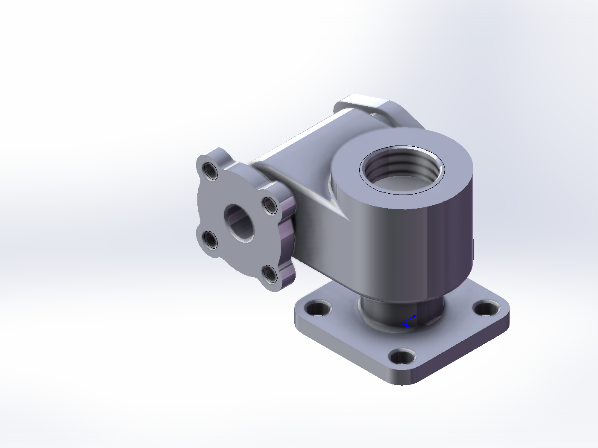
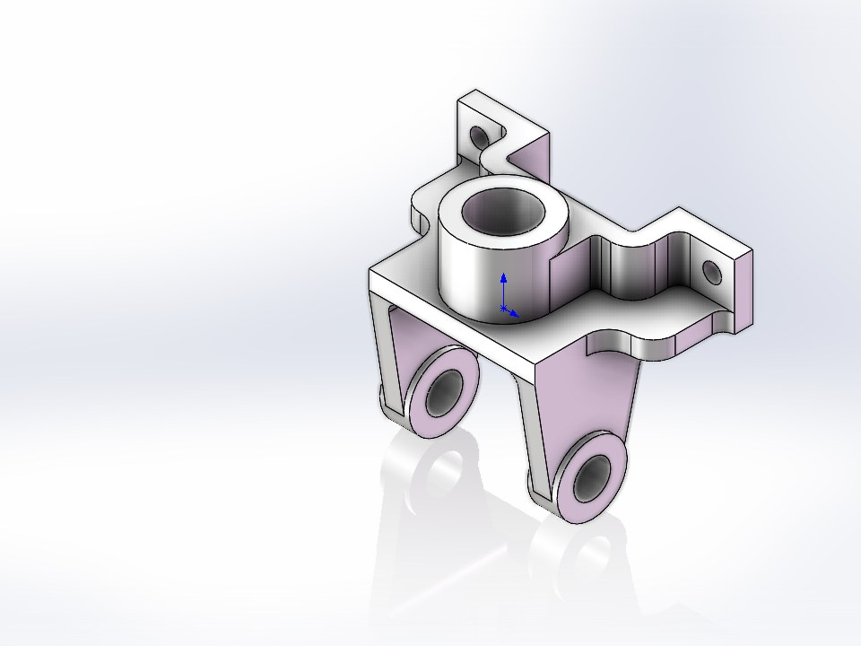
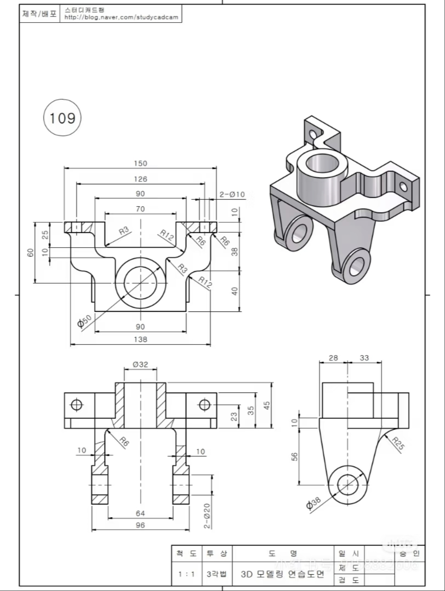
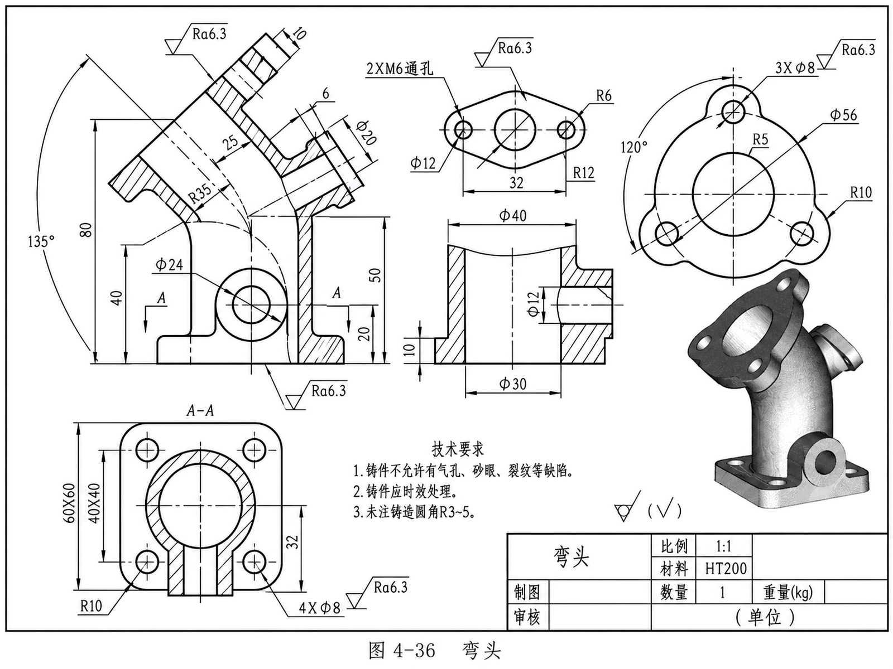

# SolidWorks Parametric CAD

当前版本：**v1.2.1** · [更新记录](CHANGELOG.md) · [版本发布](https://github.com/panp20469-png/solidworks-parametric-cad-skill/releases)

面向工程图的 SolidWorks 自动建模实验项目：包括 agent skill、读图与位置关系规则，以及弯头、109 双耳支架、LJT06.06 阀体三个零件的案例资料。

这是公开发布的实验版。弯头案例已记录两次从空白零件到保存的完整执行；109 支架在修复后已使用公开案例脚本完成一次从空白零件到保存的完整自动运行，12 组特征全部通过，并提供过程录像。弯头与 109 支架均于 2026-09-30 补充完成实体测量及 AI 剖面、视图对照，记录 `DRAWING_MATCH_PASS`。阀体于2026-10-08补齐R3/C1后重新从零录制，26组特征通过，并完成77项实测及10图对照。以上三个固定案例不构成任意工程图自动转换或通用自动验收能力的证明。

## 作者与贡献

发起与维护：[panp20469-png](https://github.com/panp20469-png)。本项目由维护者提出读图、位置关系、局部修改与剖面对照要求，结合 AI 辅助整理 skill 和实现、调试自动化脚本。第三方 COM 客户端有单独来源与许可证，不属于维护者独立原创的底层实现。公开提交用于记录后续版本演进，不冒充全部早期开发历史。

## 案例展示

| 案例 | 模型与视频 | 验证层级 |
| --- | --- | --- |
| 弯头 | 下方输入图、过程录像及原生模型 | 两次从零运行；[DRAWING_MATCH_PASS：63 项核验及九个视图对照](docs/demo/elbow-validation/report.md) |
| 109 双耳支架 | [案例说明](docs/drawing109.md)、[模型](docs/demo/drawing109/drawing109.SLDPRT)、[自动建模视频](docs/demo/drawing109/automated-build-2x.mp4) | 一次从零运行，12 组特征通过；[DRAWING_MATCH_PASS：50 项核验及六个视图对照](docs/demo/drawing109/full-validation/report.md) |
| LJT06.06 阀体 | [案例说明](docs/valve_ljt06_06.md)、[模型](docs/demo/valve_ljt06_06/valve_LJT06_06.SLDPRT)、[输入图](docs/demo/valve_ljt06_06/source-drawing.jpg) | 26组特征从零运行；[自动建模录像](docs/demo/valve_ljt06_06/automated-build-2x.mp4)；[DRAWING_MATCH_PASS：77项核验及10个视图](docs/demo/valve_ljt06_06/full-validation/report.md) |

### 第三个案例：LJT06.06 阀体



本案例增加了多剖视图、内腔与四个端口、两种端法兰及技术要求的处理。修正后的公开脚本已从零运行26组特征，并完成77项实体检查、10个视图及剖面对照，记录 `DRAWING_MATCH_PASS`。提供[连续自动建模录像（2倍速，约186秒）](docs/demo/valve_ljt06_06/automated-build-2x.mp4)、运行日志和完整验收数据。详见[案例证据与限制](docs/valve_ljt06_06.md)。

v1.2.0 同时修正实体倒角枚举与空特征检测，完善局部验证、外观保留和识图复核规则；见[更新记录](CHANGELOG.md)。

### 第二个案例：109 双耳支架



[观看或下载自动建模全过程录像（2 倍速，约 56 秒）](docs/demo/drawing109/automated-build-2x.mp4)：从新建空白零件开始，实际执行全部 12 组特征、R6 圆角和保存；录制的是修正后脚本的一次完整运行，不是模型旋转动画。运行约 110.69 秒，完整录制约 114 秒。



提供 [建模脚本和尺寸记录](examples/drawing109/)、[运行日志](docs/demo/drawing109/replay-log.json)、[验证摘要](docs/demo/drawing109/validation.json)。输入图来自维护者提供的 studycadcam 编号 109 学习图，不属于本项目原创，不纳入 MIT 许可。

### 第一个案例：弯头

### 输入二维图纸



### 建模过程与结果

- [观看或下载建模演示视频](docs/demo/elbow-demo.mp4)：记录一次案例运行及模型展示；如果 GitHub 页面不能播放，可下载 MP4 查看。
- [下载原生 SolidWorks 模型](docs/demo/elbow.SLDPRT)：在 SolidWorks 中查看特征树、尺寸和剖面，与上图对照。
- [历史运行记录](docs/validation.md)；[2026-09-30 图纸一致性验收报告](docs/demo/elbow-validation/report.md)：63 项数值检查及九个实际 SW 视图经 AI 对照通过，`DRAWING_MATCH_PASS`。

输入图为维护者提供的“图 4-36 弯头”学习案例，教材名称、作者及公开再分发授权尚未核实，不主张该工程图为本项目原创，也不将其纳入 MIT 授权。这里展示固定案例的输入、执行过程、输出和独立验收证据，不代表任意图纸自动转换或通用验收能力。验收图片由 SolidWorks 实际生成。

## 内容

- `solidworks-parametric-cad/`：skill 主文件、读图规则、几何转换说明及历史 VBS 工具。
- `examples/elbow/elbow_clean_rebuild/run_elbow.py`：弯头案例唯一推荐入口。
- `examples/elbow/external_sources/Solidworks-MCP-Server/sw_client.py`：基于第三方项目修改的 COM 客户端，保留上游许可证。
- `docs/validation.md`：验证结果和能力边界。

## 环境与运行

已记录环境为 Windows、SolidWorks 2024、Python 3.12。需要可正常使用的 SolidWorks 安装；其他版本尚未验证。建议使用 64 位 Python 和独立虚拟环境。

在仓库根目录执行：

```powershell
py -3.12 -m venv .venv
.\.venv\Scripts\python.exe -m pip install -r requirements.txt
.\.venv\Scripts\python.exe examples/elbow/elbow_clean_rebuild/run_elbow.py
```

执行建模命令前，手动打开一个 SolidWorks 实例并退出草图或特征编辑状态。运行期间不要切换活动文档。脚本连接现有实例、新建一个零件，输出原生 SLDPRT 和日志到案例的 `output/`；默认不导出 STEP。

此命令复现固定案例，不接收图片作为命令行输入。新图纸由 agent 根据 skill 完成读图、参数与位置关系整理，再生成相应建模流程。

## 使用 Skill

把仓库中的 `solidworks-parametric-cad` 文件夹安装到 agent 的 skills 目录。例如 Codex 使用 `$HOME/.codex/skills/`。已有同名 skill 时先比较差异，不直接覆盖个人版本。

提供工程图并要求使用 `solidworks-parametric-cad`。skill 本身是流程说明，不是独立的视觉识别模型；使用它的 agent 必须能读取图纸并执行本地工具。

## 验证边界

2026-09-13 的原始工作目录中，弯头两次完整运行耗时 103.70 秒与 111.11 秒，均报告重建通过、单实体、几何错误为零，包含局部圆角和装饰螺纹。两次历史日志保留当时的 `AWAITING_USER_REVIEW`。2026-09-30 已对弯头和 109 支架分别补做实体测量及 AI 视图对照，两者均记录 `DRAWING_MATCH_PASS`，详见各案例报告。

成功案例直接调用 Python/COM，不能作为 MCP 全链路运行证据。本发布包不包含可直接部署的 MCP server；需要 MCP 时须另行配置、验证实际调用链。

发布副本移除了开发者机器路径，并做静态检查；尚未在另一台电脑完成运行验证。复杂图纸、其他 SolidWorks 版本和任意参数变化均未获得普遍适用性证明。

## 授权与来源

本项目原创代码与文档采用 [MIT 许可证](LICENSE)，允许使用、修改与再分发，包括商业使用，须保留许可证要求的版权和许可声明。第三方 COM 客户端的来源及修改范围见 [THIRD_PARTY_NOTICES.md](THIRD_PARTY_NOTICES.md)，其原许可证保持不变。SolidWorks 本体不包含在仓库内。

历史失败模型、个人运行日志、访问凭据及软件安装文件不随公开包分发。
