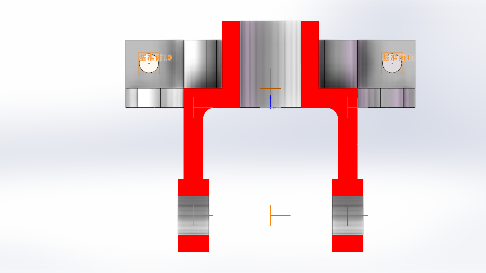
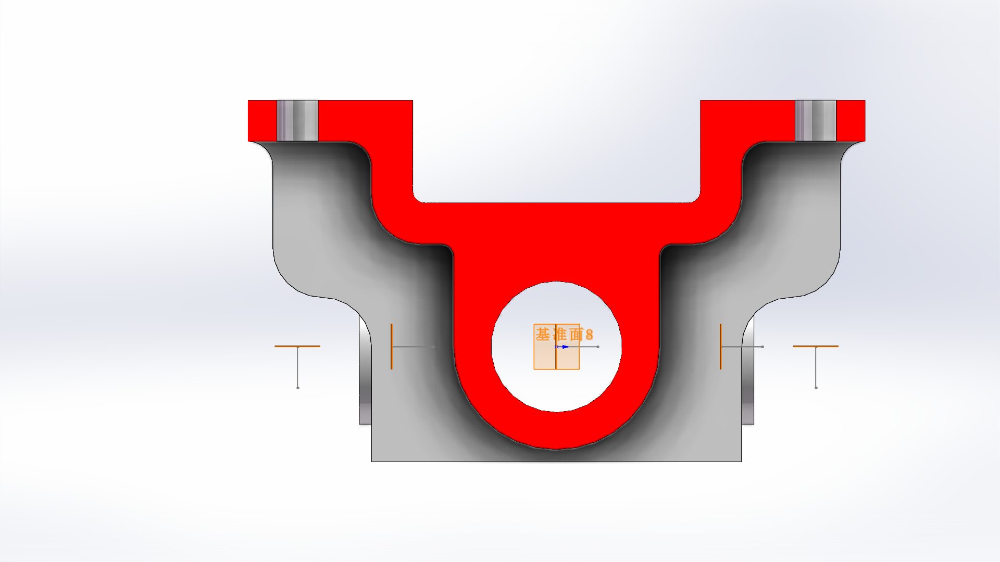
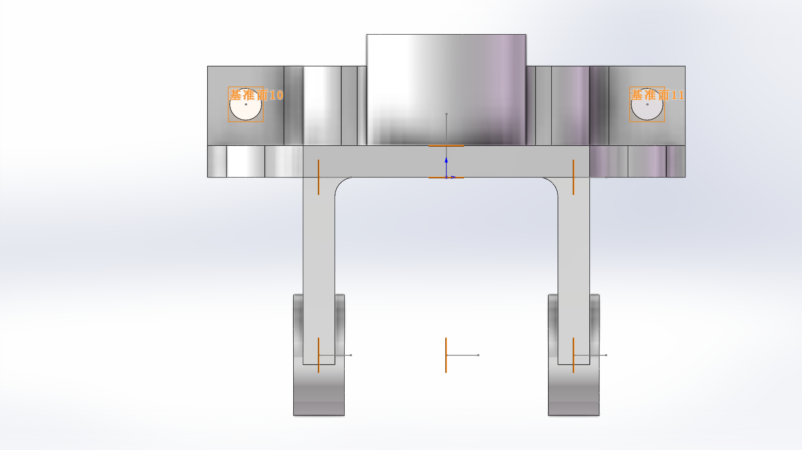
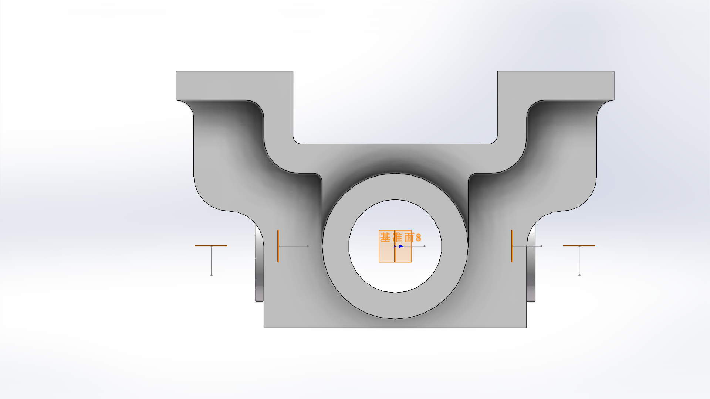
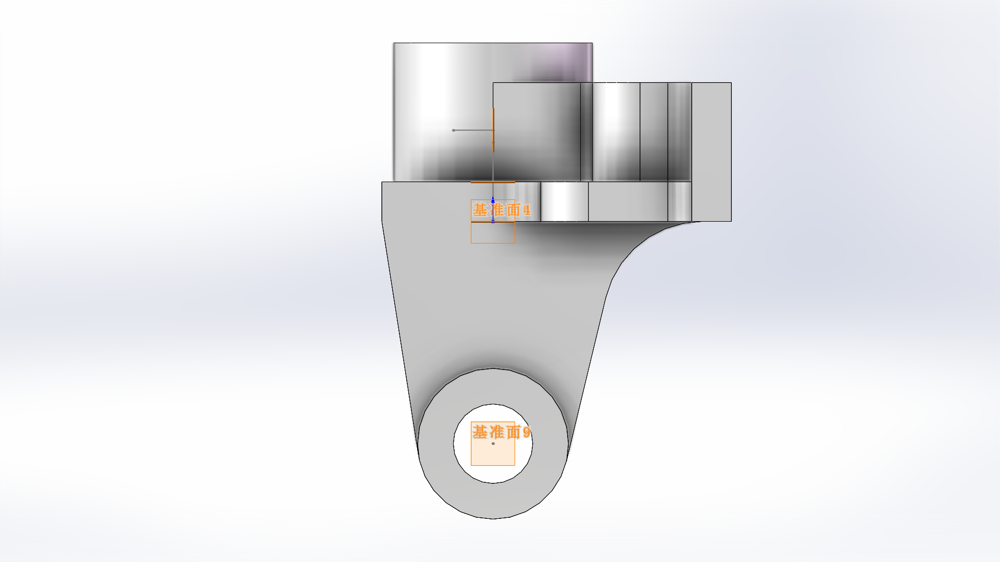
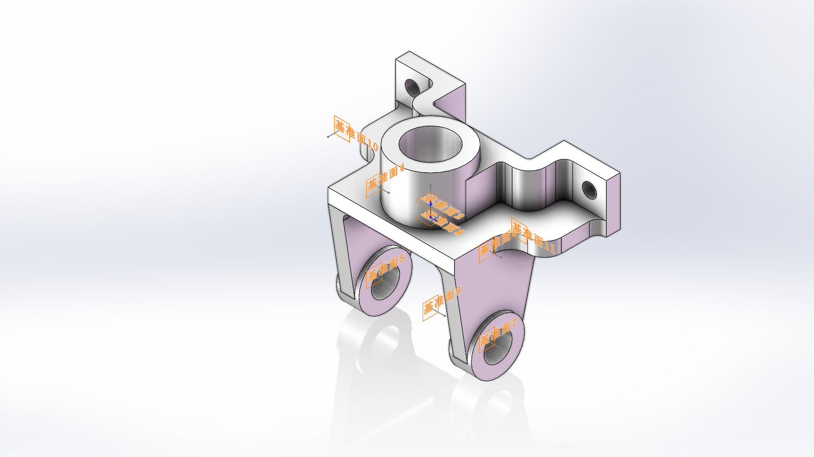

# 109 双耳支架图纸一致性验收

**结果：`DRAWING_MATCH_PASS`（2026-09-30）。**

对已公开的原生模型进行只读检查，没有重新建模或修改模型。34 项尺寸和 16 项位置、轴向、贯通、相切、对称及实体数检查通过；六个视图经 AI 对照原图通过。

这是固定案例的名义几何验收：数值由 SolidWorks 实体面、边界圆和端点独立读取，数值比较阈值为 0.001 mm（计算核验阈值，不是图纸制造公差）。截图由 SolidWorks 直接输出，仅无损转码为 PNG。材料、未标注制造要求、其他图纸和跨机器运行不在本次验收范围。

模型 SHA256：`b984ff75dbcedf53de8728d88c589c5d6c134c6c533962376ec03286a61c9d8a`。

[机器可读报告](report.json) · [原始实体测量](measurements.json) · [AI 视图审查](visual-review.json) · [取图与方向记录](view_capture_verified.json)

## 尺寸与关系核验

| 编号 | 项目 | 图纸期望（mm；方向/数量除外） | 实测 | 结果 |
|---|---|---|---|---|
| D01 | 后耳总宽 | 150 | 150 | PASS |
| D02 | 安装孔轴间距 | 126 | 126 | PASS |
| D03 | 后壁外宽 | 90 | 90 | PASS |
| D04 | 后槽宽 | 70 | 70 | PASS |
| D05 | 后耳厚度 | [10, 10] | [10, 10] | PASS |
| D06 | 后槽深度 | 25 | 25 | PASS |
| D07 | 中央桥厚 | 10 | 10 | PASS |
| D08 | 竖孔轴至后边 | 60 | 60 | PASS |
| D09 | 耳前面至肩部 | 38 | 38 | PASS |
| D10 | 肩部至前边 | 40 | 40 | PASS |
| D11 | 翼板宽 | 138 | 138 | PASS |
| D12 | 前板宽 | 90 | 90 | PASS |
| D13 | 凸台外径 | 50 | 50 | PASS |
| D14 | 两安装孔直径 | [10, 10] | [10, 10] | PASS |
| D15 | 后槽内角 R3 | [3, 3] | [3, 3] | PASS |
| D16 | 弯壁内侧 R12 | [12, 12] | [12, 12] | PASS |
| D17 | 后壁与翼板局部 R6 | [6, 6, 6, 6] | [6, 6, 6, 6] | PASS |
| D18 | 凸台旁 R3 | [3, 3] | [3, 3] | PASS |
| D19 | 肩部四处 R12 | [12, 12, 12, 12] | [12, 12, 12, 12] | PASS |
| D20 | 竖孔直径 | 32 | 32 | PASS |
| D21 | 凸台总高 | 45 | 45 | PASS |
| D22 | 后壁总高 | 35 | 35 | PASS |
| D23 | 两安装孔轴高 | [23, 23] | [23, 23] | PASS |
| D24 | 两腹板厚度 | [10, 10] | [10, 10] | PASS |
| D25 | 耳台内间距 | 64 | 64 | PASS |
| D26 | 耳台外间距 | 96 | 96 | PASS |
| D27 | 两耳孔直径 | [20, 20] | [20, 20] | PASS |
| D28 | 两腹板内根 R6 | [6, 6] | [6, 6] | PASS |
| D29 | 孔轴至前边 | 28 | 28 | PASS |
| D30 | 后斜面延长至板底的理论位置 | [33, 33] | [33, 33] | PASS |
| D31 | 底板厚 | 10 | 10 | PASS |
| D32 | 下耳孔轴至板底 | [56, 56] | [56, 56] | PASS |
| D33 | 两下耳外径 | [38, 38] | [38, 38] | PASS |
| D34 | 腹板后缘 R25 | [25, 25] | [25, 25] | PASS |
| R01 | 三组孔轴方向（绝对分量） | [[0, 1, 0], [1, 0, 0], [1, 0, 0], [0, 0, 1], [0, 0, 1]] | [[0, 1, 0], [1, 0, 0], [1, 0, 0], [0, 0, 1], [0, 0, 1]] | PASS |
| R02 | 凸台与竖孔共轴 XZ | [[0, 0], [0, 0]] | [[0, 0], [0, 0]] | PASS |
| R03 | 下耳圆柱与孔共轴 YZ | [[-56, 0], [-56, 0], [-56, 0], [-56, 0]] | [[-56, 0], [-56, 0], [-56, 0], [-56, 0]] | PASS |
| R04 | 安装孔对称位置 | [[-63, 23], [63, 23]] | [[-63, 23], [63, 23]] | PASS |
| R05 | 竖孔圆柱边界贯穿 Y0 至 Y45 | [0, 45] | [0, 45] | PASS |
| R06 | 两安装孔贯穿整个耳厚 | [[-60, -50], [-60, -50]] | [[-60, -50], [-60, -50]] | PASS |
| R07 | 耳孔贯穿各耳台且中间分离 | [[-48, -32], [32, 48]] | [[-48, -32], [32, 48]] | PASS |
| R08 | 内根圆角轴位置 | [[29, -6], [-29, -6]] | [[29, -6], [-29, -6]] | PASS |
| R09 | 前后腹板斜面与下耳外圆相切 | [19, 19, 19, 19] | [19, 19, 19, 19] | PASS |
| R10 | R25 与板底及后斜面相切 | [25, 25, 25, 25] | [25, 25, 25, 25] | PASS |
| R11 | 前斜面理论起点 | [28, 28] | [28, 28] | PASS |
| R12 | 肩部双圆弧相切 | 24 | 24 | PASS |
| R13 | 实体数 | 1 | 1 | PASS |
| R14 | 各俯视圆角的局部圆心位置 | [[32, -38], [-32, -38], [-33, -37], [33, -37], [-51, -44], [51, -44], [-75, -44], [75, -44], [-28, -22], [28, -22], [-57, -24], [-57, 0], [57, 0], [57, -24]] | [[32, -38], [-32, -38], [-33, -37], [33, -37], [-51, -44], [51, -44], [-75, -44], [75, -44], [-28, -22], [28, -22], [-57, -24], [-57, -1.77636e-15], [57, 0], [57, -24]] | PASS |
| R15 | 俯视圆角轴均平行 Y | [[0, 1, 0], [0, 1, 0], [0, 1, 0], [0, 1, 0], [0, 1, 0], [0, 1, 0], [0, 1, 0], [0, 1, 0], [0, 1, 0], [0, 1, 0], [0, 1, 0], [0, 1, 0], [0, 1, 0], [0, 1, 0]] | [[0, 1, 0], [0, 1, 0], [0, 1, 0], [0, 1, 0], [0, 1, 0], [0, 1, 0], [0, 1, 0], [0, 1, 0], [0, 1, 0], [0, 1, 0], [0, 1, 0], [0, 1, 0], [0, 1, 0], [0, 1, 0]] | PASS |
| R16 | 全部边界顶点关于 X0 镜像的最大误差 | 0 | 2.71875e-14 | PASS |

## 视图证据

正视剖切位于 Z=0；俯视剖切位于 Y=23，穿过后耳孔轴。原图俯视为局部剖切组合表达，因此同时使用未剖切俯视图核对凸台外圆。红色为 SW 剖面封盖，橙色为原生参考几何标记。

Z=0 正视剖切：竖孔贯通底板；两腹板实心，内根圆角连续；耳台孔贯穿且双耳中间为空。



Y=23 俯视剖切：两后耳孔处于剖切面，后槽与弯壁相连，中央孔为空。原图为局部剖切组合表达，凸台外圆另由未剖切俯视图核对。



正视：左右对称，后耳孔同高，凸台高于后壁，双耳下伸并分离。



俯视：后槽、弯壁、翼板肩部与前板轮廓一致；中心凸台及孔同心。



右视：凸台及后耳高度阶差、前斜边、后侧 R25 过渡、耳圆及耳孔与图纸一致。



等轴测：底板、后壁、中心凸台和双耳连成一体，三组孔方向正确，与图纸立体示意一致。



## 复核方式

在仓库根目录运行以下命令，可重算已发布测量快照的 50 项数值检查，并检查视图审查记录和文件哈希：

```powershell
python examples/drawing109/validation/check_measurements.py
python examples/drawing109/validation/finalize_report.py
```

需要重新采集实体时，先在现有 SW 实例中打开并激活 docs/demo/drawing109/drawing109.SLDPRT，再运行 examples/drawing109/validation/measure_model.py。不要运行建模入口来替代测量。面编号只适用于这个模型快照；新模型需重新确认面归属、拍摄剖面并审查，旧审查记录不能自动沿用。

本次数值核验使用 Python/COM，连接、取图及剖面操作使用现场 MCP。它不证明 MCP 完成了原始建模全链路。显示恢复时发现 RemoveSectionView 返回 false，随后关闭本次只读检查文档并重新打开，未保存显示改动；普通视图与剖面图哈希均不同。
