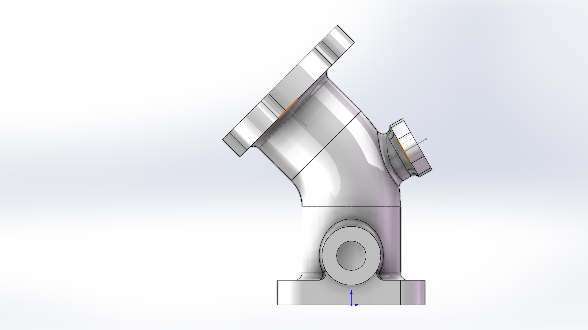
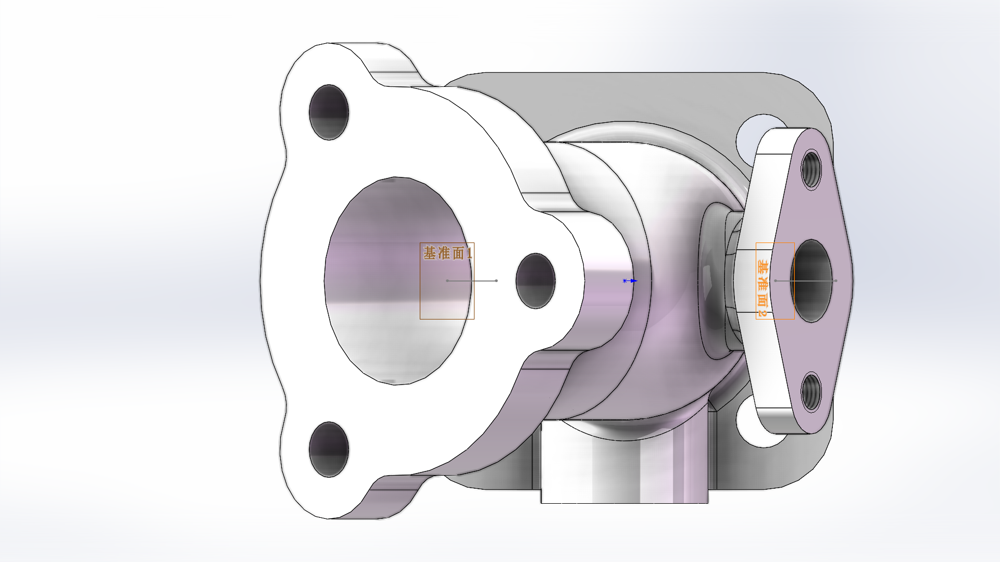
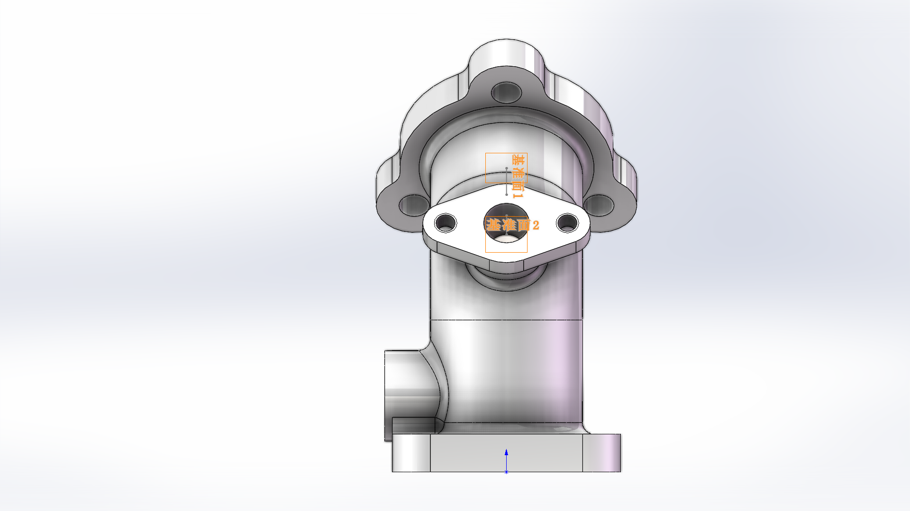
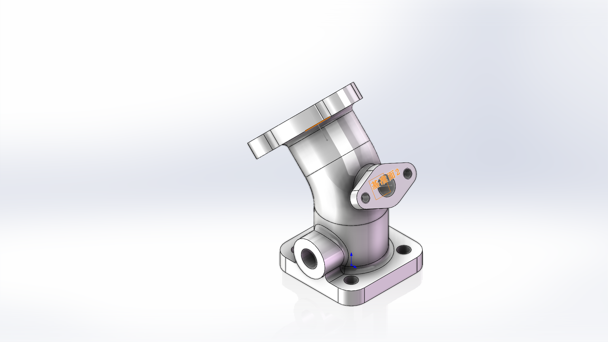
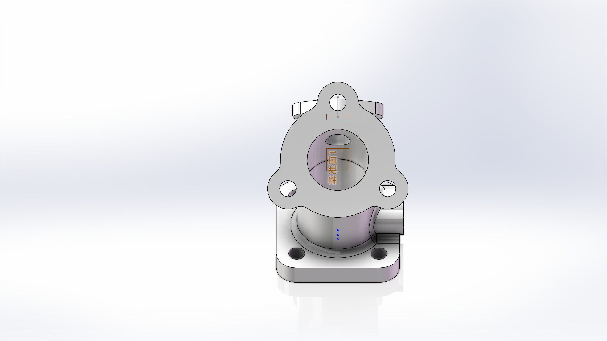
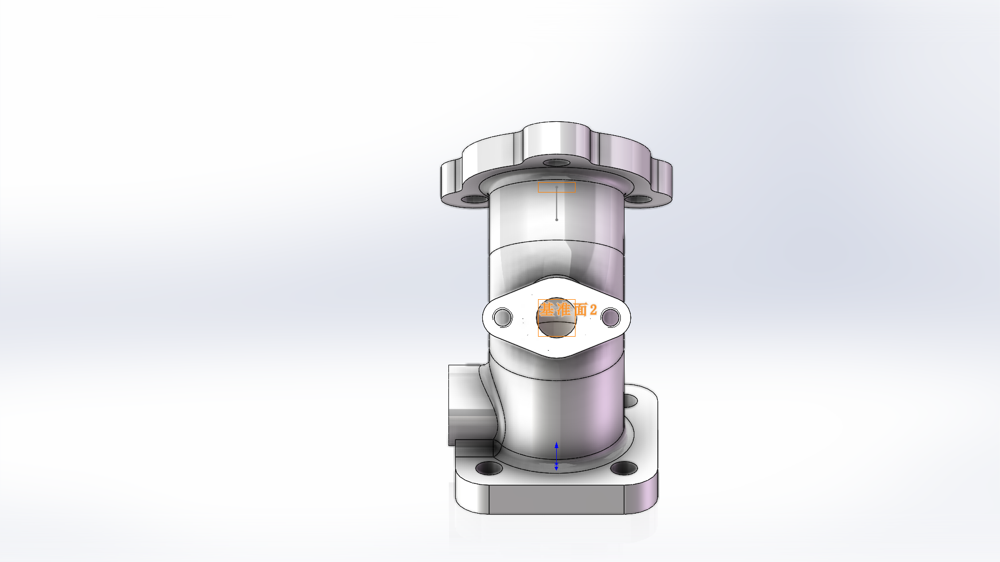
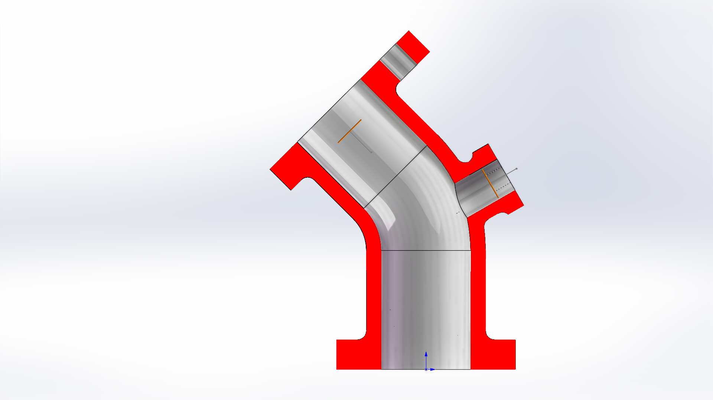
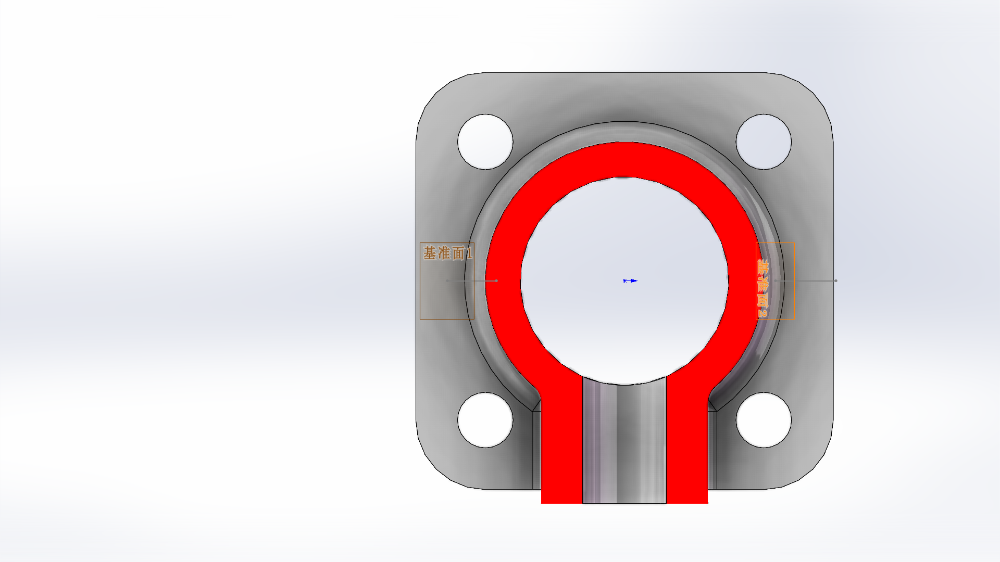
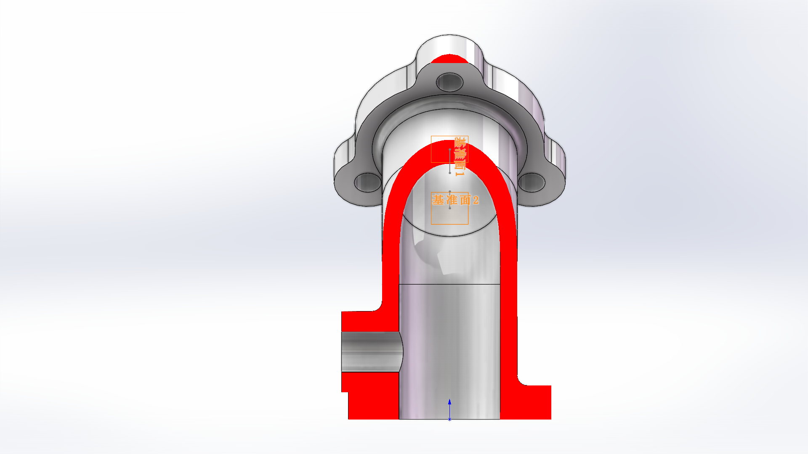

# 图 4-36 弯头图纸一致性验收

**结果：`DRAWING_MATCH_PASS`（2026-09-30，名义几何范围）。**

对已公开的 elbow.SLDPRT 只读检查，63 项尺寸、方向、位置、孔贯通范围、螺纹定义及相切检查通过；九个 SW 视图经 AI 对照原图通过。模型未重建、未修改。

模型 SHA256：`fa44d17e0b59a71d77a19f2b32bdd094d7b5937f95e19b225187c26eaa230859`。

[机器可读报告](report.json) · [原始实体测量](measurements.json) · [特征读回](features.json) · [取图方向及 AI 对照记录](visual-review.json)

## 范围与图纸项目覆盖

- 底座：60×60、厚 10、R10、四孔 Φ8 和 40×40 孔距。
- 主管：Φ40/Φ30、R35、40/80 高度及 135° 上段方向、内外同轴和上下贯通。
- B 端：厚 10、主体 Φ56、三孔 Φ8、120° 分布、R10 耳和 R5 过渡；轮廓按现有已确认合同核对。
- 侧支管与 C 端：轴高 50、合同确认的轴向和位置、25+6 尺寸链、Φ20/Φ12、R12/R6、两孔间距 32。
- 正面凸台：Φ24/Φ12、中心高 20、端面距主管轴 32，并由 A-A 和纵剖证明内部连通。
- 2×M6 通孔：实际 Φ5 底孔 + M6x1 THRU 装饰螺纹，长度 6；不是实体螺旋牙型。
- 未注铸造过渡：两组圆角特征读回 R3，位于图示连接部位，在 R3～5 范围内；结合实体可解析圆角面及视图核对。
- Ra6.3、HT200、时效处理及不允许气孔/砂眼/裂纹属于材料或制造要求，本次不以 CAD 几何证明这些要求已实现。比例、数量和标题属于图纸元数据。

数值对比阈值为 0.001 mm，角度检查阈值 0.001°；这是计算复核阈值，不是图纸制造公差。侧支管轴向和上法兰轮廓按仓库中已确认合同解释，未为本次验收修改合同。结论仅适用于此模型哈希，不代表任意工程图的通用自动验收或跨机器运行。

## 数值核验

| 编号 | 项目 | 期望 | 实测 | 结果 |
|---|---|---|---|---|
| E01 | 底座宽 | 60 | 60 | PASS |
| E02 | 底座深 | 60 | 60 | PASS |
| E03 | 底座厚 | 10 | 10 | PASS |
| E04 | 底座四角 R10 | [10, 10, 10, 10] | [10, 10, 10, 10] | PASS |
| E05 | 底座四孔 Φ8 | [8, 8, 8, 8] | [8, 8, 8, 8] | PASS |
| E06 | 底座孔数 | 4 | 4 | PASS |
| E07 | 底座四孔 XZ 位置 | [[-20, -20], [-20, 20], [20, -20], [20, 20]] | [[-20, -20], [-20, 20], [20, -20], [20, 20]] | PASS |
| E08 | 底座四孔贯穿范围 | [[0, 10], [0, 10], [0, 10], [0, 10]] | [[0, 10], [0, 10], [0, 10], [0, 10]] | PASS |
| E09 | 主管上下直段外径 | [40, 40] | [40, 40] | PASS |
| E10 | 主管上下直段内径 | [30, 30] | [30, 30] | PASS |
| E11 | 弯管内外中心线 R35 | [35, 35] | [35, 35] | PASS |
| E12 | 弯管中心坐标 | [[-35, 40, 0], [-35, 40, 0]] | [[-35, 40, 0], [-35, 40, 0]] | PASS |
| E13 | 弯管内外半径与壁厚 | [20, 15, 5] | [20, 15, 5] | PASS |
| E14 | 下主管轴线 XZ | [[0, 0], [0, 0]] | [[0, 0], [0, 0]] | PASS |
| E15 | 主管上下轴向 | [[0, 1, 0], [-0.707107, 0.707107, 0]] | [[0, 1, 0], [-0.707107, 0.707107, 0]] | PASS |
| E16 | 主管上段方向角 | 135 | 135 | PASS |
| E17 | 下直段与内弯管连接高 | 40 | 40 | PASS |
| E18 | 下主管通到底面 | 0 | 0 | PASS |
| E19 | B 后端中心高度 | 80 | 80 | PASS |
| E20 | B 法兰厚度 | 10 | 10 | PASS |
| E21 | B 法兰主体 Φ56 | [56, 56, 56] | [56, 56, 56] | PASS |
| E22 | B 三耳 R10 | [10, 10, 10] | [10, 10, 10] | PASS |
| E23 | B 六处轮廓 R5 | [5, 5, 5, 5, 5, 5] | [5, 5, 5, 5, 5, 5] | PASS |
| E24 | B 三孔 Φ8 | [8, 8, 8] | [8, 8, 8] | PASS |
| E25 | B Φ8 圆柱面数 | 3 | 3 | PASS |
| E26 | B 孔中心节圆半径 | [28, 28, 28] | [28, 28, 28] | PASS |
| E27 | B 孔相邻角度 | [120, 120, 120] | [120, 120, 120] | PASS |
| E28 | B 三孔贯穿厚度 | [[0, 10], [0, 10], [0, 10]] | [[7.10543e-15, 10], [0, 10], [0, 10]] | PASS |
| E29 | B 主体与上主管共轴 | [0, 0, 0, 0] | [2.51215e-15, 2.51215e-15, 2.51215e-15, 5.02431e-15] | PASS |
| E30 | 上主管通至法兰外面 | 10 | 10 | PASS |
| E31 | 侧支管外径 | [20] | [20] | PASS |
| E32 | 侧支管内径 | [12] | [12] | PASS |
| E33 | 侧支管轴高 | 50 | 50 | PASS |
| E34 | 侧支管轴向 | [0.866025, 0.5, 0] | [0.866025, 0.5, 0] | PASS |
| E35 | 侧支管轴线基准 | [0, 50, 0] | [0, 50, 0] | PASS |
| E36 | 侧支管 25 尺寸端点 | 25 | 25 | PASS |
| E37 | 侧法兰厚 6 | 6 | 6 | PASS |
| E38 | 侧法兰总轴向位置 | 31 | 31 | PASS |
| E39 | C 中央轮廓 R12 | [12, 12] | [12, 12] | PASS |
| E40 | C 两耳 R6 | [6, 6] | [6, 6] | PASS |
| E41 | C 中孔与支管共轴 | [0, 0, 0, 0] | [1.2307e-14, 0, 3.55271e-15, 3.55271e-15] | PASS |
| E42 | M6 底孔孔距 | 32 | 32 | PASS |
| E43 | M6 底孔 Φ5 | [5, 5] | [5, 5] | PASS |
| E44 | 两螺纹底孔轴向范围 | [[25, 31], [25, 31]] | [[25, 31], [25, 31]] | PASS |
| E45 | 两底孔轴向 | [[0.866025, 0.5, 0], [0.866025, 0.5, 0]] | [[0.866025, 0.5, 0], [0.866025, 0.5, 0]] | PASS |
| E46 | 装饰螺纹数 | 2 | 2 | PASS |
| E47 | 螺纹公称直径 | [6, 6] | [6, 6] | PASS |
| E48 | 螺纹标注 | [M6x1 THRU, M6x1 THRU] | [M6x1 THRU, M6x1 THRU] | PASS |
| E49 | 螺纹通孔定义 | [2, 2] | [2, 2] | PASS |
| E50 | 螺纹长度 | [6, 6] | [6, 6] | PASS |
| E51 | 正面凸台 Φ24 | [24] | [24] | PASS |
| E52 | 正面孔 Φ12 | [12] | [12] | PASS |
| E53 | 正面孔中心高 | [20, 20] | [20, 20] | PASS |
| E54 | 正面端面距主管轴 32 | 32 | 32 | PASS |
| E55 | 正面凸台与孔共轴 | [[0, 20], [0, 20]] | [[0, 20], [0, 20]] | PASS |
| E56 | 正面凸台轴向 | [[0, 0, 1], [0, 0, 1]] | [[0, 0, 1], [0, 0, 1]] | PASS |
| E57 | 两组铸造过渡特征 R3 | [3, 3] | [3, 3] | PASS |
| E58 | 可解析铸造过渡面的 R3 | [3, 3, 3, 3, 3, 3] | [3, 3, 3, 3, 3, 3] | PASS |
| E59 | 单实体 | 1 | 1 | PASS |
| E60 | B 六段 R5 与主体圆弧相切 | [33, 33, 33, 33, 33, 33] | [33, 33, 33, 33, 33, 33] | PASS |
| E61 | B 六段 R5 与耳圆相切 | [15, 15, 15, 15, 15, 15] | [15, 15, 15, 15, 15, 15] | PASS |
| E62 | C 四斜边与 R12 相切 | [12, 12, 12, 12] | [12, 12, 12, 12] | PASS |
| E63 | C 四斜边与 R6 相切 | [6, 6, 6, 6] | [6, 6, 6, 6] | PASS |

## 视图证据

普通视图及 B/C 端视在启用剖切之前采集。主剖 Z=0，A-A 为 Y=20，凸台纵剖为 X=0；红色为剖面封盖。原图半剖和局部视图通过全剖与普通视图组合核对。所有截图由 SW 生成，只做像素完全一致的无损 PNG 编码。

主视外形与原图非剖切部分相符：上法兰、侧支管、正面凸台和底座位置对应。



俯视确认底座四孔及两法兰方向，凸台伸出底座前边。



右视确认正面凸台方向和主体连接，无多余独立实体。



等轴测形态、三耳上法兰、双耳侧法兰和底座与原图立体示意对应。



沿上法兰实际端面法向查看：三孔等间隔，三耳轮廓和中央通孔对应 B 端视。



沿侧法兰实际端面法向查看：两耳孔与中央通道共用端面，R12/R6 外切轮廓对应 C 端视。



Z=0 主剖面：主管从底部经弯曲段贯通上法兰，侧孔与主管连通，背侧壁保持实心。原图为半剖表达，此处用全剖及普通主视组合核对。



Y=20 的 A-A 剖面：主管环形壁、正面凸台通道和底座四孔符合图纸；凸台孔与主管连通且未切穿背侧。



X=0 纵剖：Φ12 凸台孔进入主管，底部与主管相连，侧壁保留，与图纸局部纵剖相符。



## 复核方式

在仓库根目录执行，可重算已发布测量快照并核对模型、截图和审查记录哈希：

```powershell
python examples/elbow/validation/check_measurements.py
python examples/elbow/validation/finalize_report.py
```

重新采集时先在现有 SW 中打开并激活 docs/demo/elbow.SLDPRT，运行 measure_model.py 和 inspect_details.py。这些脚本只读取实体和特征，后者会切换端视显示。面编号只适用于本模型快照；变更模型后必须重新核对面归属及截图，不得自动套用旧的视图审查。

本次使用 Python/COM 独立测量、现场 MCP 取标准视图和剖面、AI 进行视觉对照。原始建模仍是此前记录的 Python/COM 两次从零运行，本次没有重跑建模或验证 MCP 完整建模链。
