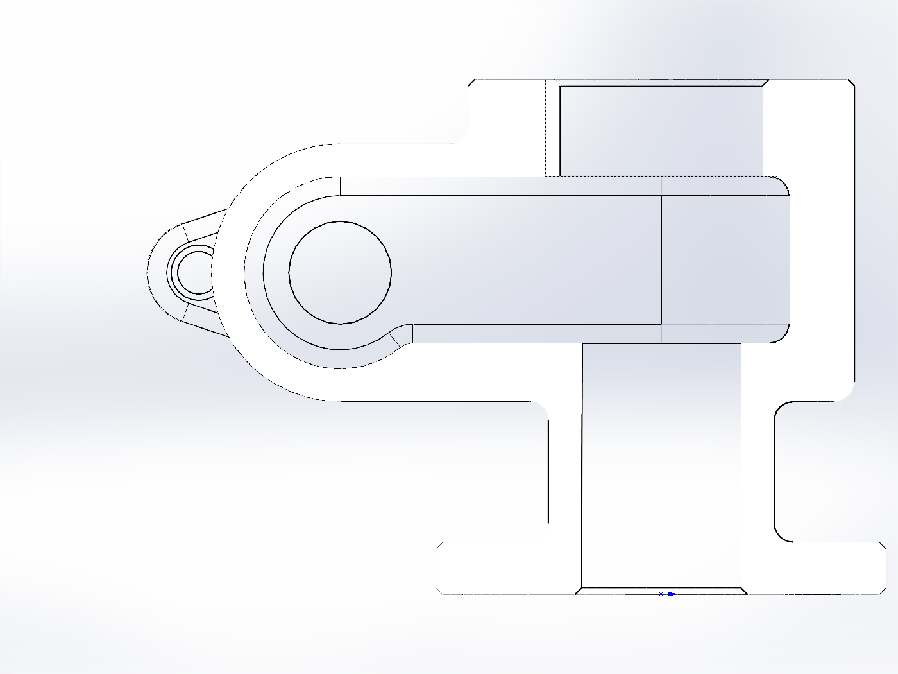
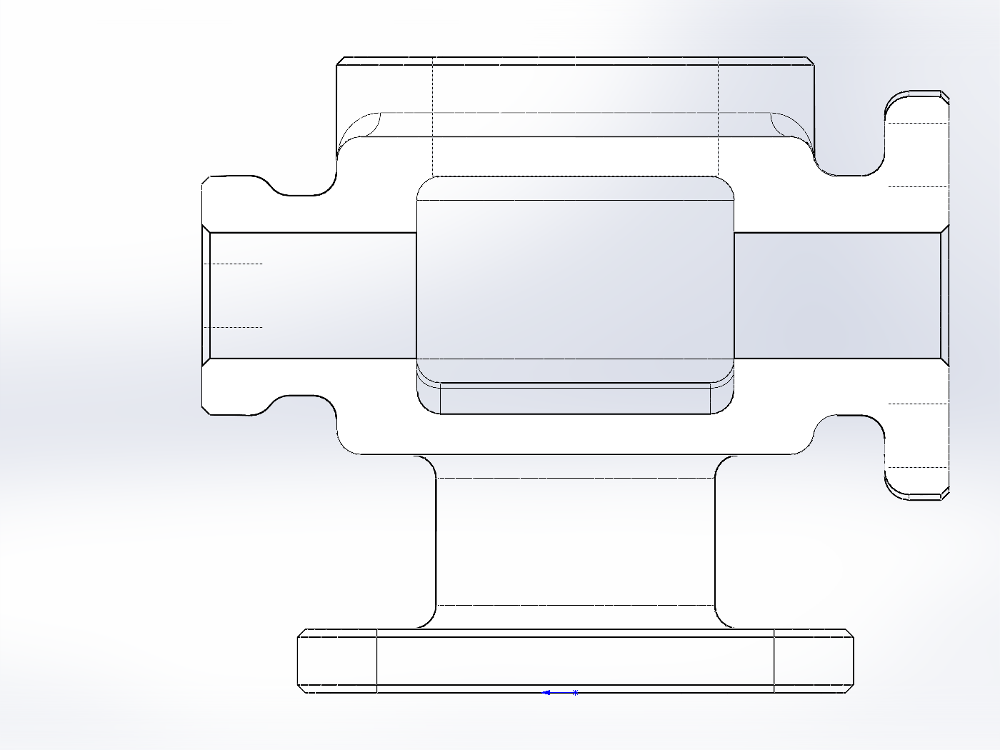
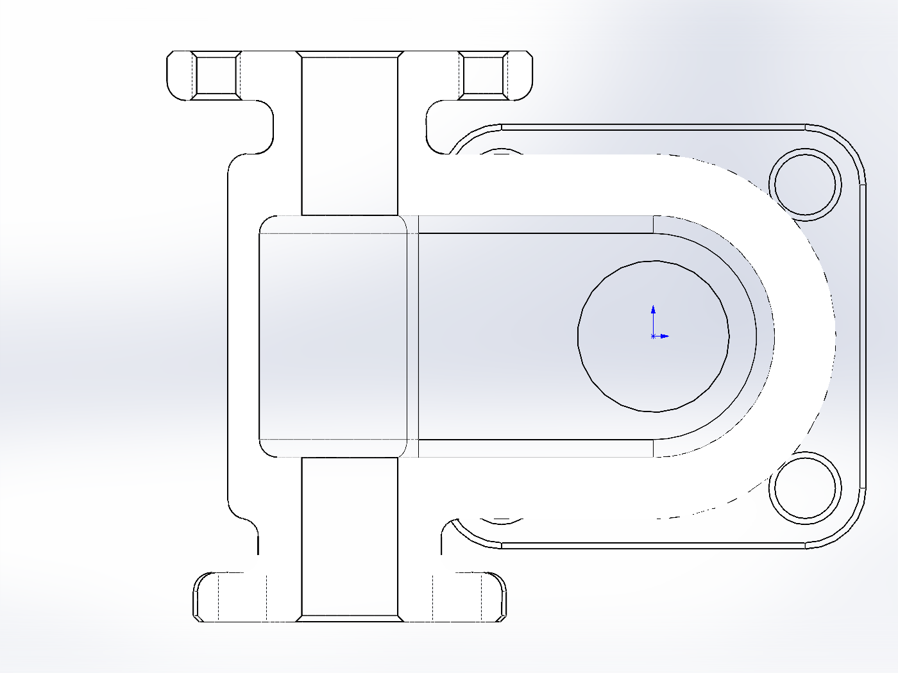

# LJT06.06 阀体完整图纸验收

日期：2026-10-08。结论：**DRAWING_MATCH_PASS**，属于本固定案例的 AI 辅助名义几何自检，不是工程认证或用户人工验收。

模型 SHA256：`65906e6b067dd45bae331290aaead2a744dd938113620f381f92a26cf50a5e85`。

## 运行与实体

- 修正后的公开入口从空白零件完整运行一次，26 组特征通过，过程无失败、无人工建模干预。运行及录制包装器耗时 374.05 秒。
- 单实体；最终重建通过。直接读取 IBody2.Check3：实体故障 0；逐特征 GetErrorCode2：错误 0、警告 0。检查失败不会退回“零错误”。
- 精确极值外包络 X=-80～35、Y=-47～47、Z=0～80 mm。运行日志中的 GetPartBox 是保守包围盒，不用于尺寸验收。
- 77 项尺寸、位置、同轴、孔阵列、相切、贯通及局部成形检查全部通过；阈值 0.001 mm 仅用于比较名义几何。
- 24 处孔口 C1 与 41 处加工外缘 C1 共 65 个倒角面均逐面检查；7 组实体圆角定义为 R3，另有草图定义的轮廓过渡，保留图纸指定 R8/R10/R20。
- 所有检查和图像绑定同一模型哈希；采图前后文件未修改。模型颜色、材质和场景未作主动更改。

## 剖面及视图

图形剖切保留了真实模型的可见远处轮廓和装饰螺纹投影；不重画工程图，也不使用生成式图片替代截图。A-A 为 Y=0，B-B 为 X=-50，俯剖为 Z=50。

| 视图 | 对照结论 |
|---|---|
| [front](front.png) | PASS：沿-Y观察，左端D法兰、主体台阶、下颈及底板相对位置一致；外部轮廓与A-A外形对应。 |
| [top](top.png) | PASS：主体外圆与上口同轴，左右连接颈直径不同，底板四角和孔阵列按投影关系分布，与原图俯视一致。 |
| [C](C.png) | PASS：从C端观察，前方两耳法兰与后方D端四耳法兰分离；两端共用横孔轴线。 |
| [B_outer](B_outer.png) | PASS：横向外形，两端法兰厚度及颈部台阶、上下主体和底颈位置符合B-B外轮廓；该图观察方向与B-B剖视相反。 |
| [isometric](isometric.png) | PASS：上下口、两横向端口、安装板和两种法兰连成单一铸件；补齐的R3及C1位置可辨。 |
| [A_A](A_A.png) | PASS：Y=0纵剖：上口、下口接入主腔；左端圆弧腔与横孔同心；主腔顶65、底39、左侧局部低至35，与26高非对称腔相符。 |
| [B_B](B_B.png) | PASS：X=-50横剖：C端在左、D端在右；两侧16孔接入腔，内腔圆角、较低局部腔底、两端颈和法兰背面的圆滑过渡均与原图对应。 |
| [C_local](C_local.png) | PASS：仅保留C端法兰局部：两耳轮廓、两螺纹孔与中央通孔的相对位置及对称关系符合C向；外围C1体现未注倒角要求。 |
| [D_local](D_local.png) | PASS：仅保留D端法兰局部：四耳与四孔同心，45度分布在直径50圆上，外轮廓和耳间过渡对应D向。 |
| [top_section](top_section.png) | PASS：Z=50俯剖：主腔右端R20和左端通道连续，下孔在主腔内开口，两横向孔与主腔接合；与原图局部俯剖对应。 |

## 可复核数据

- [77项检查明细](checks.json)、[原始实体曲面及边界测量](measurements.json)、[特征定义](features.json)
- [原生故障检查](native-checks.json)、[相机及剖切状态、图像哈希](views.json)、[AI逐图对照记录](visual-review.json)
- [连续自动建模录像](../automated-build-2x.mp4)、[录制信息](../recording.json)、[原始重放日志](../replay-log.json)、[特征状态](../replay-state.json)
- [验证脚本](../../../../examples/valve_ljt06_06/validation/)、[尺寸合同](../../../../examples/valve_ljt06_06/contract.json)、[原图](../source-drawing.jpg)

运行日志保留建模结束当时的 BASIC_CHECK_PASS / AWAITING_USER_REVIEW / NOT_RUN 字段；它们早于独立验收，不是当前总结。最终从零重放结果见 recording.json，独立图纸验收见本报告和 validation.json。

## 本次发现并修复的遗漏

首次从零执行成功仍未满足全图：两端颈—法兰背面及法兰背面外缘未完整执行未注R3，C1只覆盖孔口而漏掉加工面外轮廓。新增组21～25并逐组核对真实生成面与材料变化，随后重新从空白零件录制最终版本。首次未修正录像不作为本版本过程证据。

## 验证边界

M36-6H和M8以基本小径孔和装饰螺纹表达，不生成实体螺旋牙型。ZL102、粗糙度、时效处理、铸造缺陷要求及GB/T公差记录为制造信息；本验收不证明制造质量或实物公差合格。未验证另一台电脑、MCP完整建模链、参数变化或陌生图纸。坐标驱动草图由独立实体测量验收，不宣称所有草图具有约束驱动的完全定义状态。
