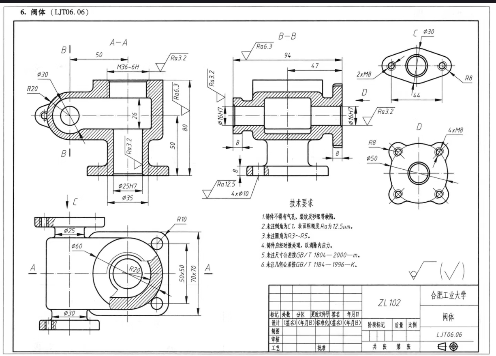

# 案例三：LJT06.06 阀体

**修正后的公开脚本已从空白零件完整运行，26 组特征通过；独立完成 77 项检查和 10 个 SolidWorks 视图对照，记录 DRAWING_MATCH_PASS。** 结论限于报告哈希对应的名义几何，是 AI 辅助自检，不是工程认证或用户人工验收。


## 输入与交付资料

- [原始二维图纸](demo/valve_ljt06_06/source-drawing.jpg)、[原生SLDPRT模型](demo/valve_ljt06_06/valve_LJT06_06.SLDPRT)
- [自动建模全过程录像（MP4，2倍速，约186秒）](demo/valve_ljt06_06/automated-build-2x.mp4)：最终修正脚本从空白零件到保存的连续窗口录制，无模型操作剪辑；不是成品旋转展示。
- [运行日志](demo/valve_ljt06_06/replay-log.json)、[录制信息及入口哈希](demo/valve_ljt06_06/recording.json)、[特征状态](demo/valve_ljt06_06/replay-state.json)
- [建模入口](../examples/valve_ljt06_06/build.py)、[局部修整函数](../examples/valve_ljt06_06/finish_edges.py)、[尺寸合同](../examples/valve_ljt06_06/contract.json)、[识图记录](../examples/valve_ljt06_06/gate.md)
- [完整验收报告、77项检查及10个视图](demo/valve_ljt06_06/full-validation/report.md)、[验证脚本](../examples/valve_ljt06_06/validation/)、[最终验证摘要](demo/valve_ljt06_06/validation.json)
- [共享倒角接口独立测试](demo/valve_ljt06_06/chamfer-helper-test.json)



输入图框标有“合肥工业大学”和“阀体 LJT06.06”，由维护者提供；未核实原始出版物、作者及再分发授权，不将图纸纳入MIT许可，详见[来源说明](../THIRD_PARTY_NOTICES.md)。截图和录像来自实际SolidWorks运行。

## 图纸难点与前两个案例的区别

| 案例 | 主要建模难点 |
|---|---|
| 弯头 | 曲线流道、倾斜管轴、非全局坐标系中的法兰与支管连接 |
| 109双耳支架 | 多层轮廓、双耳及腹板、局部根部圆角的精确选边 |
| 阀体 | 多剖视图共同确定内腔和四个端口；不同端法兰；26高内腔与横孔轴线不对称；螺纹、C1及铸造R3过渡同时存在 |

阀体相较支架增加了内腔和端口连通的读图负担；三者难点不同，没有统一量化难度测试，不能用固定案例证明任意复杂图纸都能处理。

## 验证与修复

- 最终重放运行及录制包装器耗时374.05秒，26组特征一次执行通过；最终运行无失败、无人工建模干预。
- 单实体，重建通过。原生IBody2.Check3故障0，逐特征GetErrorCode2错误0、警告0。
- 精确外包络X=-80～35、Y=-47～47、Z=0～80mm，即115×94×80mm。
- 77项实体实测全部通过，覆盖孔径、厚度、孔阵列、同轴关系、四端口接腔边界和局部成形。65个C1倒角面包含24个孔口及41个加工外缘；7组实体圆角为R3，并保留指定R8/R10/R20。
- A-A（Y=0）、B-B（X=-50）、内腔俯剖（Z=50）、两端局部图及普通视图共10图完成AI对照；矩阵、剖切状态和图片哈希均公开。
- 没有主动修改颜色、材质或场景。临时线条显示和非破坏剖切仅用于验收截图，不保存为零件状态。

早期识图漏看D向圆在耳部的细线延续，放大后闭合孔位。此前修复过共享倒角封装使用无效实体类型0导致“有特征但无实际面”的问题，现使用类型1并检验真实几何。

此次完整剖面对照又发现两端颈—法兰背面及背面外缘R3缺项，以及加工面外轮廓C1遗漏。修复纳入组21～25后重新从空白零件录制；公开模型与视频均来自最终运行。v1.2.0仅局部检查的历史记录保留，本次补齐资料发布为v1.2.1。

## 运行与验证边界

按首页安装依赖，手动打开SolidWorks，在仓库根目录执行：

```powershell
python examples/valve_ljt06_06/build.py
python examples/valve_ljt06_06/validation/measure_model.py
python examples/valve_ljt06_06/validation/check_measurements.py
python examples/valve_ljt06_06/validation/check_native.py
python examples/valve_ljt06_06/validation/capture_views.py
```

输出写入`examples/valve_ljt06_06/output/`，与发布模型分开。脚本读取固定合同并复用弯头平面草图/COM辅助函数，不直接解析任意图片。已有恢复状态时须保持本任务零件为活动文档。视图采集应从未剖切的保存模型开始；视觉验收结论需要对照原图，不由截图脚本自动给出。

运行日志保留生成结束时的基础检查状态；随后独立验收的最终状态见完整报告和验证摘要，不能只看日志中的历史NOT_RUN字段。

M36-6H及6处M8采用基本小径和装饰螺纹，没有实体螺旋牙型。ZL102、Ra3.2/Ra6.3/未注Ra12.5、时效处理、铸造缺陷要求及GB/T公差记录为制造信息，名义模型不能证明制造质量。当前验证为Python/COM，不是MCP全链路；尚未验证跨机器、参数变化或陌生图纸泛化。
